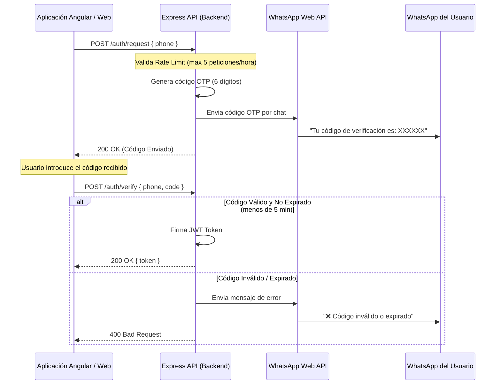
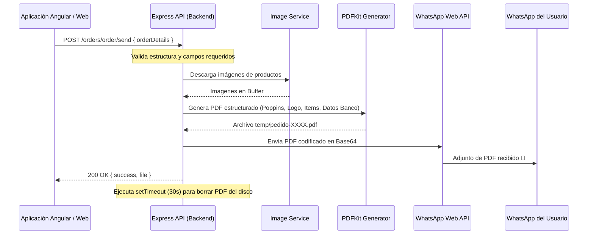

# HoDie WhatsApp Integration Service 🚀

Este servicio es el backend encargado de la integración entre la plataforma web de **HoDie Tienda de Regalos** y la mensajería de **WhatsApp**. Sus funciones principales son gestionar el inicio de sesión sin contraseña (passwordless) mediante códigos OTP (One-Time Password) y procesar los pedidos de los clientes, enviándoles un comprobante en PDF de alta calidad y actualizando el estado de sus compras directamente a sus chats de WhatsApp.

---

## ✨ Características Principales

1. **Autenticación Passwordless (OTP):** Generación de códigos numéricos de verificación de 6 dígitos que se envían por WhatsApp para validar la identidad del usuario sin requerir contraseñas.
2. **Generación de Comprobantes PDF:** Conversión automática de los detalles de un pedido en un PDF con diseño premium (incorporando logo de la marca, tipografía Poppins, imágenes de productos y detalles bancarios).
3. **Notificaciones de Estado de Pedidos:** Envío de mensajes automáticos que alertan al cliente sobre cambios de estado en su compra (Pendiente, Pagado, En preparación, Enviado, Entregado, Cancelado).
4. **Chatbot de Auto-respuesta:** Menú básico de respuestas automáticas a palabras clave frecuentes enviadas por los usuarios (como "hola", "precios", "ubicacion", "catalogo").

---

## ⚙️ Stack Tecnológico

* **Core:** Node.js (ES Modules)
* **Framework Web:** Express (v5.1.0)
* **Integración WhatsApp:** whatsapp-web.js (v1.34.4)
* **Generación de PDF:** PDFKit (v0.17.2)
* **Navegador Emulado:** Puppeteer (para la ejecución interna de WhatsApp Web)
* **Seguridad:** JSON Web Token (JWT) y políticas de Rate Limit en memoria

---

## 📂 Arquitectura y Estructura del Proyecto

El código está estructurado en una arquitectura limpia de capas:

```text
hodie-wa-app/
├── assets/                  # Recursos estáticos (Logos, imágenes y fuentes del PDF)
│   ├── banco.png            # Infografía con datos bancarios
│   ├── logo.png             # Logo oficial de HoDie
│   └── fonts/               # Tipografía Poppins para el PDF
├── src/
│   ├── app.js               # Configuración de Express, CORS y Middlewares
│   ├── config/              # Configuraciones globales
│   │   ├── auth.js          # Parámetros del ciclo de vida del OTP y límites de peticiones
│   │   ├── jwt.js           # Clave secreta y vigencia del JWT
│   │   └── whatsapp.js      # Inicialización del cliente de WhatsApp y chatbot
│   ├── controllers/         # Controladores (Lógica de negocio de endpoints)
│   │   ├── auth.controller.js
│   │   └── order.controller.js
│   ├── routes/              # Enrutadores
│   │   ├── auth.routes.js
│   │   └── order.routes.js
│   └── services/            # Servicios de soporte técnico e infraestructura
│       ├── image.service.js # Descarga de imágenes externas
│       ├── pdf.service.js   # Renderizado de PDF
│       └── whatsapp.service.js # Funciones de envío de mensajes en WhatsApp
├── server.js                # Inicializador del servidor y WhatsApp Web
└── package.json             # Dependencias y scripts
```

---

## 🔁 Flujos de Trabajo Principales

### 1. Autenticación Passwordless

El flujo describe cómo un usuario solicita el inicio de sesión y recibe un token JWT firmado tras validar el código enviado a su WhatsApp.



### 2. Procesamiento de Pedido y Envío de PDF

El flujo detalla la recepción de una compra, la descarga de imágenes del producto, el renderizado del PDF con PDFKit y su envío final por chat.



---

## 📡 Endpoints del API

### Rutas de Autenticación (`/auth`)

#### 1. Solicitar Código OTP
* **Ruta:** `POST /auth/request`
* **Cuerpo:**
```json
{
  "phone": "595981234567"
}
```
* **Respuesta (Exitosa):**
```json
{
  "success": true,
  "message": "Código enviado por WhatsApp"
}
```

#### 2. Verificar Código OTP
* **Ruta:** `POST /auth/verify`
* **Cuerpo:**
```json
{
  "phone": "595981234567",
  "code": "123456"
}
```
* **Respuesta (Exitosa):**
```json
{
  "success": true,
  "message": "Usuario verificado correctamente",
  "token": "eyJhbGciOiJIUzI1NiIsInR5cCI6IkpXVCJ9..."
}
```

#### 3. Verificar Sesión
* **Ruta:** `POST /auth/session`
* **Cabecera:** `Authorization: Bearer <TOKEN>`
* **Respuesta (Exitosa):**
```json
{
  "success": true,
  "message": "Sesión válida",
  "phone": "595981234567"
}
```

#### 4. Cerrar Sesión
* **Ruta:** `POST /auth/logout`
* **Cabecera:** `Authorization: Bearer <TOKEN>`
* **Respuesta (Exitosa):**
```json
{
  "success": true,
  "message": "Sesión cerrada correctamente"
}
```

---

### Rutas de Pedidos (`/orders`)

#### 1. Procesar y Enviar Pedido
* **Ruta:** `POST /orders/order/send`
* **Cuerpo:**
```json
{
  "id": "ord-abc123xyz",
  "orderNumber": "10024",
  "userId": "usr-987",
  "userDisplayName": "Juan Pérez",
  "userPhoneNumber": "595981234567",
  "items": [
    {
      "productName": "Taza Personalizada",
      "productSku": "TAZ-001",
      "quantity": 2,
      "price": 45000,
      "imageUrl": "https://url-de-la-imagen-del-producto.com/taza.jpg",
      "selectedPackaging": {
        "name": "Caja de Regalo de Lujo",
        "price": 10000,
        "imageUrl": "https://url-de-la-imagen-del-paquete.com/caja.jpg"
      }
    }
  ],
  "shippingAddress": {
    "city": "Minga Guazú",
    "department": "Alto Paraná",
    "street": "Calle Palma 123",
    "instructions": "Entregar en portón negro"
  },
  "subtotal": 110000,
  "total": 110000,
  "createdAt": {
    "seconds": 1718889900
  }
}
```
* **Respuesta (Exitosa):**
```json
{
  "success": true,
  "message": "Pedido 10024 procesado y enviado al cliente.",
  "file": "/ruta/absoluta/a/temp/pedido-10024.pdf"
}
```

#### 2. Actualizar Estado de Pedido
* **Ruta:** `POST /orders/order/status`
* **Cuerpo:**
```json
{
  "phone": "595981234567",
  "status": "preparing",
  "amount": 110000
}
```
* **Estados Permitidos (`status`):**
    * `pending`: Recibido con éxito, a la espera del comprobante de pago.
    * `paid`: Pago confirmado.
    * `preparing`: En proceso de empaque o fabricación.
    * `shipped`: Pedido enviado a través de la transportadora.
    * `delivered`: Compra entregada y finalizada con éxito.
    * `cancelled`: Compra anulada.

---

## 🛠️ Instalación y Configuración Local

### Requisitos Previos

1. **Node.js** (Versión 18 o superior recomendada).
2. **Dependencias del Navegador:** Dado que `whatsapp-web.js` ejecuta Puppeteer, tu sistema operativo debe tener instaladas las bibliotecas nativas necesarias para ejecutar Chromium sin interfaz gráfica.
   * **En Linux (Ubuntu/Debian):**
     ```bash
     sudo apt install -y gconf-service libasound2 libatk1.0-0 libc6 libcairo2 libcups2 libdbus-1-3 libexpat1 libfontconfig1 libgcc1 libgconf-2-4 libgdk-pixbuf2.0-0 libglib2.0-0 libgtk-3-0 libnspr4 libpango-1.0-0 libpangocairo-1.0-0 libstdc++6 libx11-6 libx11-xcb1 libxcb1 libxcomposite1 libxcursor1 libxdamage1 libxext6 libxfixes3 libxi6 libxrandr2 libxrender1 libxss1 libxtst6 ca-certificates fonts-liberation libappindicator1 libnss3 lsb-release xdg-utils wget libgbm-dev
     ```

### Configuración del Entorno

Crea un archivo `.env` en la raíz del proyecto basándote en la siguiente estructura:

```env
PORT=3000
JWT_SECRET=tu_clave_secreta_super_segura
```

### Pasos de Ejecución

1. Instala las dependencias del proyecto:
   ```bash
   npm install
   ```
2. Ejecuta el servidor en modo desarrollo:
   ```bash
   npm run dev
   ```
3. **Escaneo del Código QR:**
   Al arrancar por primera vez, el servidor imprimirá un código QR en la terminal. Escanéalo usando la aplicación móvil de WhatsApp (Sección *Dispositivos Vinculados*).
   Una vez emparejado, se creará la carpeta `./sessions/` para mantener activa la sesión y no requerir el escaneo en futuros reinicios.
